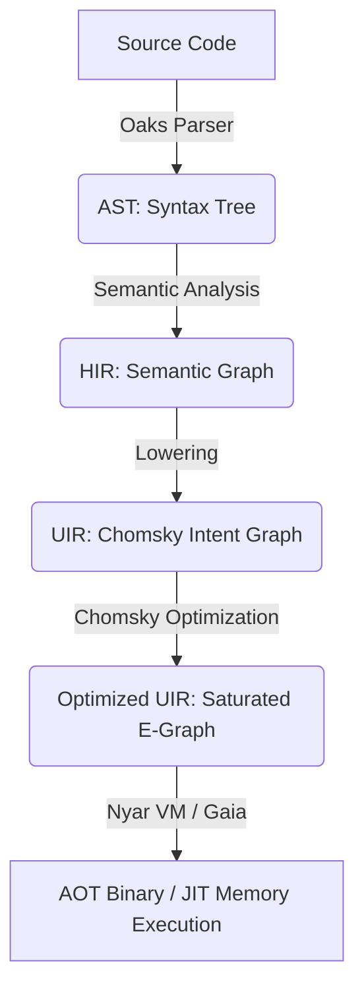

# Valkyrie Compiler Optimization Strategies: Modern Architecture Based on Nyar VM and Chomsky

## Preface

This document comprehensively elaborates on the modern optimization architecture adopted by the Valkyrie compiler. Since 2026, Valkyrie has fully transitioned to a **Nyar VM**-centric approach, utilizing the E-Graph equality saturation technology provided by **ProjectChomsky** to achieve unified efficient optimization in both AOT and JIT modes.

## Chapter 1: Architecture Philosophy and Optimization Overview

### 1.1 Core Design Philosophy

1.  **Intent-Driven**
    The Valkyrie frontend no longer handles complex low-level optimization passes, but instead lowers high-level semantics into universal "intents".
2.  **Equality Saturation**
    Utilizes E-Graph technology to explore the program's equivalence transformation space without losing information, seeking the execution path with minimum cost.
3.  **Backend-Agnostic**
    Optimization logic is centralized in the Chomsky engine, whether generating WASM, Native, or JIT execution, all share the same set of optimization rules.

### 1.2 Modern Pipeline Overview

## Chapter 2: Detailed Optimization at Each Stage

### 2.1 Frontend Stage (Oaks / valkyrie-compiler)
*   **HIR Desugaring**: Handles high-level language features such as pattern matching and algebraic effects.
*   **Type Inference Optimization**: Eliminates unnecessary runtime type checks.

### 2.2 Lowering Stage (HIR -> UIR)
*   **Semantic Mapping**: Maps HIR's control flow and data flow to Chomsky UIR.
*   **Inline Preprocessing**: Identifies hot functions that can be inlined.

### 2.3 Optimization Core (Nyar VM / Chomsky)
*   **E-Graph Construction**: Converts UIR into equivalence class graphs.
*   **Rewrite Rule Application**: Parallel application of hundreds or thousands of mathematically equivalent and logically equivalent rewrite rules.
*   **Cost Model Extraction**: Extracts the optimal instruction tree from the saturated E-Graph based on the cost model of the target backend (such as WASI or x86_64).

### 2.4 Emission Stage (Nyar VM / Gaia)
*   **Register Allocation**: Efficient allocation for physical machine or virtual machine registers.
*   **Instruction Scheduling**: Optimizes instruction order based on hardware pipeline characteristics.

---
*Note: By shifting the optimization focus to Nyar VM, Valkyrie achieves deeper global optimization than traditional SSA architectures.*
