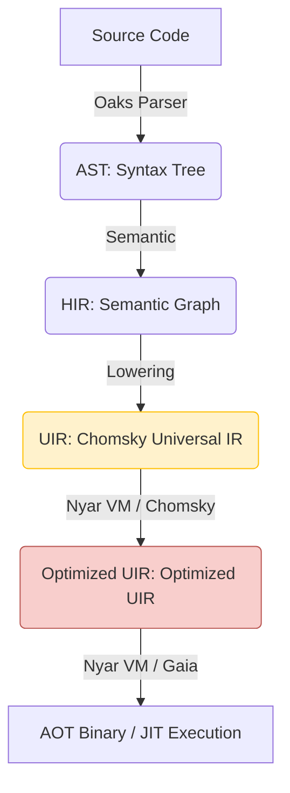

# Valkyrie Project Architecture and Maintenance Guide

**Document Version**: 1.0
**Target Audience**: Core developers and maintainers of the Valkyrie project

## 1. Top-level Design Principles

Valkyrie's architecture follows best practices in modern compiler design, aiming to balance high performance, extensibility, and development efficiency.

### 1.1 Modern Compilation Pipeline

Valkyrie's architecture has evolved into a modern pipeline centered on **Nyar VM** and **Chomsky**, combining traditional lowering processes with advanced E-Graph optimization.

- **AST -> HIR**: Introduces scopes, name resolution, and type information.
- **HIR -> UIR**: Converts language-specific semantic primitives into Chomsky's universal intents.
- **UIR Optimization**: Performs global optimization using Chomsky's equality saturation engine in Nyar VM.
- **Backend Emission**: Generates machine code or binary artifacts through Gaia-driven code emitters.

### 1.2 Developer Experience (DX) First

- **Diagnostic Information**: Uses `miette` to provide high-quality error reporting.
- **Instant Feedback**: Achieves fast iteration through efficient incremental compilation (planned).

## 2. Project Organization (Crate Structure)

Valkyrie adopts a Rust Monorepo structure, with all core components located in the `projects/` directory.

- **`valkyrie`**: **Integration Tool**. Entry point integrating compiler and runtime.
- **`valkyrie-compiler`**: **Core Compiler Frontend and Lowering Layer**. Built on Oaks, responsible for lowering source code to Chomsky UIR.
- **`valkyrie-types`**: Core type definitions used by the compiler, including unified error handling.
- **`nyar-vm`**: **Core Runtime and Optimization Driver**. Integrates Chomsky optimization engine, provides AOT and JIT execution capabilities.
- **`valkyrie-interpreter`**: **High-Performance Runtime**. Provides bytecode execution capabilities.
- **`valkyrie-lsp`**: Language server support.
- **`valkyrie-cli`**: Command-line tool.
- **`oak-valkyrie`**: New frontend implementation based on Oak (Lexer, Parser, AST).

## 3. Maintenance Process

### 3.1 Adding New Optimization Passes
1. Implement the corresponding Trait in `valkyrie-vm` (such as `CfgFunctionPass` or `SsaFunctionPass`).
2. Add the corresponding optimization logic in the `valkyrie-vm/src/passes/` directory.
3. Write unit tests and snapshot tests to verify output.

### 3.2 Error Handling Standards
- All compiler errors should be defined in `valkyrie-types/src/errors`.
- Use macros provided by `miette` to enrich error context.
