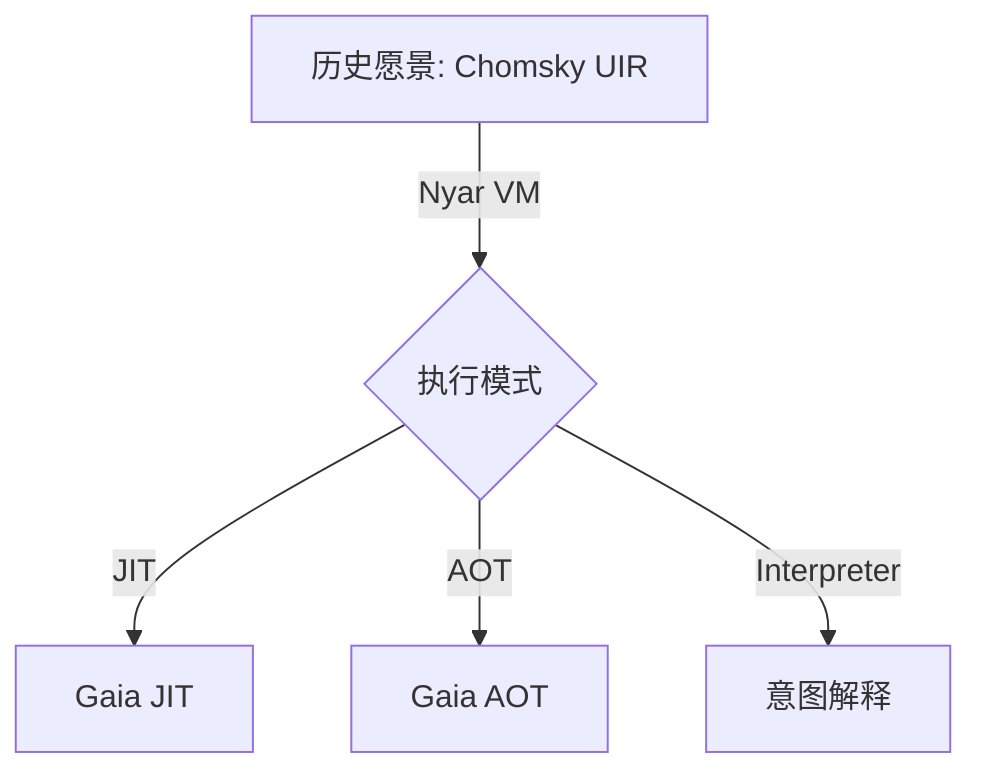

# Valkyrie 执行模型

## 1. 概述

Valkyrie 支持多种执行面（开发期运行、AOT 产物、托管运行时）。**文档必须区分现状与愿景。**

## 2. 现状（以源码为准）

```text
语言主链 (nyar-language: HIR/MIR)
  -> 规划 (nyar)
  -> FragmentSubmission
  -> nyar-emitter 目标降低
  -> 手写二进制 (std-data: pe / class / wasm …)
  -> 由对应宿主执行（dotnet / java / wasmtime / … 仅作运行与验读）
```

- 四目标自举焦点：**clr / jvm / wasm / wasi**。
- 工作区内另有 `nvm`、`legacy-vm`、`text-vm` 等运行时相关 crate，能力以各 crate 为准。
- `nyar-optimizer` 的 egraph 等能力仍在演进，**不是**「已全面取代一切优化 Pass」的完成态。

## 3. 愿景（非现行承诺）

历史材料描述的「一切先降为 Chomsky UIR，再由 Nyar VM 在 JIT/AOT/解释器间分发，并由 Gaia 发射机器码」属于**长期方向/旧叙述**。在本仓库未以成员依赖形式落地前，**不要**按该图实现或评审现行工作。



上图仅作愿景示意。

## 4. Legacy LIR / SSA 叙述

- 早期「多层 SSA→LIR 再分后端」已不再作为**推荐跨目标主链**。
- 现行仍保留 **MIR（SSA 风格）** 作为语言侧主表示之一；legacy `LIR` 有 deprecated 过渡资产。
- 旧文「已全面废弃 SSA」与现行 MIR 矛盾，以本节为准。

## 5. 共享运行时能力（目标相关）

托管目标使用各自 GC/运行时（CLR / JVM / WASM GC）。确定性资源与效应/延续的完整支持按后端文档与实现进度追踪，不在此重复夸大。
