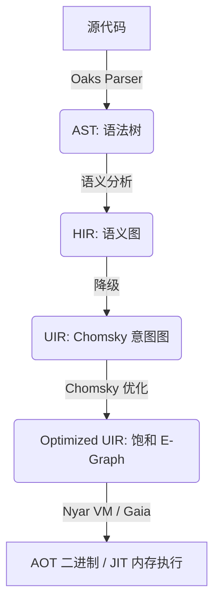

# Valkyrie 编译器优化策略：基于 Nyar VM 与 Chomsky 的现代架构

## 前言

本文档全面阐述了 Valkyrie 编译器采用的现代化优化架构。自 2026 年起，Valkyrie 已全面转向以 **Nyar VM** 为核心，利用 **ProjectChomsky** 提供的 E-Graph 等价饱和技术，实现 AOT 与 JIT 模式下的统一高效优化。

## 第一章：架构哲学与优化全景图

### 1.1 核心设计哲学

1.  **意图驱动 (Intent-Driven)**
    Valkyrie 前端不再负责复杂的低级优化 Pass，而是将高级语义降级为通用的“意图”（Intents）。
2.  **等价饱和 (Equality Saturation)**
    利用 E-Graph 技术，在不丢失信息的情况下探索程序的等价变换空间，寻找代价最小的执行路径。
3.  **后端中立 (Backend-Agnostic)**
    优化逻辑集中在 Chomsky 引擎中，无论是生成 WASM、Native 还是 JIT 执行，共享同一套优化规则。

### 1.2 现代流水线概览

## 第二章：各阶段优化详述

### 2.1 前端阶段 (Oaks / valkyrie-compiler)
*   **HIR 脱糖**: 处理模式匹配、代数效应等高级语言特性。
*   **类型推导优化**: 消除不必要的运行时类型检查。

### 2.2 降级阶段 (HIR -> UIR)
*   **语义映射**: 将 HIR 的控制流和数据流映射为 Chomsky UIR。
*   **内联预处理**: 识别可内联的热点函数。

### 2.3 优化核心 (Nyar VM / Chomsky)
*   **E-Graph 构建**: 将 UIR 转化为等价类图。
*   **重写规则应用**: 并行应用成百上千条数学等价、逻辑等效的重写规则。
*   **代价模型提取**: 根据目标后端（如 WASI 或 x86_64）的代价模型，从饱和的 E-Graph 中提取最优指令树。

### 2.4 发射阶段 (Nyar VM / Gaia)
*   **寄存器分配**: 针对物理机器或虚拟机寄存器进行高效分配。
*   **指令调度**: 根据硬件流水线特性优化指令顺序。

---
*注：通过将优化重心移至 Nyar VM，Valkyrie 实现了比传统 SSA 架构更深度的全局优化。*
