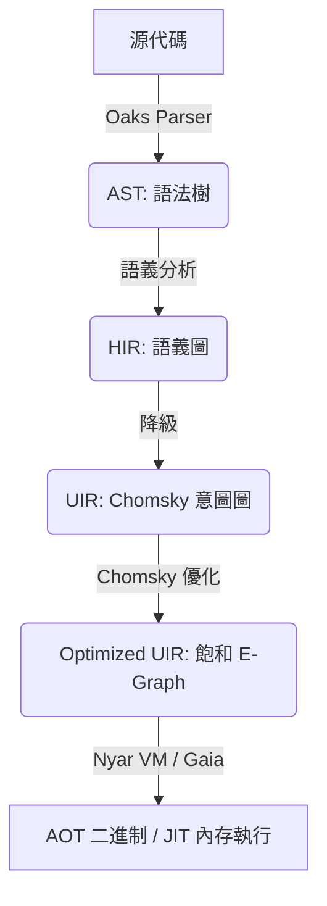

# Valkyrie 編譯器優化策略：基於 Nyar VM 與 Chomsky 的現代架構

## 前言

本文檔全面闡述了 Valkyrie 編譯器採用的現代化優化架構。自 2026 年起，Valkyrie 已全面轉向以 **Nyar VM** 為核心，利用 **ProjectChomsky** 提供的 E-Graph 等價飽和技術，實現 AOT 與 JIT 模式下的統一高效優化。

## 第一章：架構哲學與優化全景圖

### 1.1 核心設計哲學

1.  **意圖驅動 (Intent-Driven)**
    Valkyrie 前端不再負責複雜的低級優化 Pass，而是將高級語義降級為通用的「意圖」（Intents）。
2.  **等價飽和 (Equality Saturation)**
    利用 E-Graph 技術，在不丟失信息的情況下探索程序的等價變換空間，尋找代價最小的執行路徑。
3.  **後端中立 (Backend-Agnostic)**
    優化邏輯集中在 Chomsky 引擎中，無論是生成 WASM、Native 還是 JIT 執行，共享同一套優化規則。

### 1.2 現代流水線概覽

## 第二章：各階段優化詳述

### 2.1 前端階段 (Oaks / valkyrie-compiler)
*   **HIR 脫糖**: 處理模式匹配、代數效應等高級語言特性。
*   **類型推導優化**: 消除不必要的運行時類型檢查。

### 2.2 降級階段 (HIR -> UIR)
*   **語義映射**: 將 HIR 的控制流和數據流映射為 Chomsky UIR。
*   **內聯預處理**: 識別可內聯的熱點函數。

### 2.3 優化核心 (Nyar VM / Chomsky)
*   **E-Graph 構建**: 將 UIR 轉化為等價類圖。
*   **重寫規則應用**: 並行應用成百上千條數學等價、邏輯等效的重寫規則。
*   **代價模型提取**: 根據目標後端（如 WASI 或 x86_64）的代價模型，從飽和的 E-Graph 中提取最優指令樹。

### 2.4 發射階段 (Nyar VM / Gaia)
*   **寄存器分配**: 針對物理機器或虛擬機寄存器進行高效分配。
*   **指令調度**: 根據硬件流水線特性優化指令順序。

---
*註：通過將優化重心移至 Nyar VM，Valkyrie 實現了比傳統 SSA 架構更深度的全局優化。*
