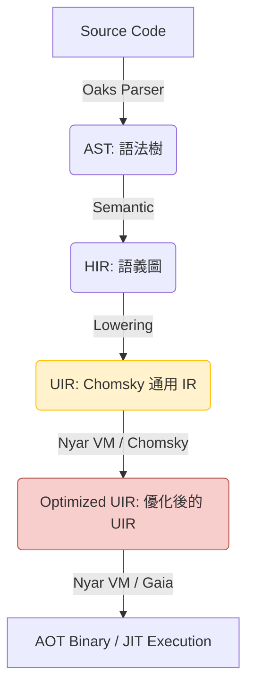

# Valkyrie 項目架構與維護指南

**文檔版本**: 1.0
**目標讀者**: Valkyrie 項目的核心開發者與維護者

## 1. 頂層設計原則

Valkyrie 的架構遵循現代編譯器設計的最佳實踐，旨在平衡高性能、可擴展性與開發效率。

### 1.1 現代編譯流水線 (Modern Compilation Pipeline)

Valkyrie 的架構已演進為以 **Nyar VM** 和 **Chomsky** 為核心的現代化流水線，將傳統的降級過程與先進的 E-Graph 優化結合。

- **AST -> HIR**: 引入作用域、名稱解析和類型信息。
- **HIR -> UIR**: 將語言特定的語義原語轉換為 Chomsky 的通用意圖 (Intents)。
- **UIR Optimization**: 利用 Chomsky 的等價飽和引擎在 Nyar VM 中進行全局優化。
- **Backend Emission**: 通過 Gaia 驅動的代碼發射器生成機器碼或二進制製品。

### 1.2 開發者體驗 (DX) 至上

- **診斷信息**: 使用 `miette` 提供高質量的錯誤報告。
- **即時反饋**: 通過高效的增量編譯（規劃中）實現快速迭代。

## 2. 項目組織 (Crate Structure)

Valkyrie 採用 Rust Monorepo 結構，所有核心組件位於 `projects/` 目錄下。

- **`valkyrie`**: **集成工具**。整合編譯器與運行時的入口。
- **`valkyrie-compiler`**: **核心編譯器前端與降級層**。基於 Oaks 構建，負責將源代碼降級為 Chomsky UIR。
- **`valkyrie-types`**: 編譯器使用的核心類型定義，包含統一的錯誤處理。
- **`nyar-vm`**: **核心運行時與優化驅動**。集成 Chomsky 優化引擎，提供 AOT 和 JIT 執行能力。
- **`valkyrie-interpreter`**: **高性能運行時**。提供字節碼執行能力。
- **`valkyrie-lsp`**: 語言服務器支持。
- **`valkyrie-cli`**: 命令行工具。
- **`oak-valkyrie`**: 基於 Oak 的新版前端實現（Lexer, Parser, AST）。

## 3. 維護流程

### 3.1 添加新的優化 Pass
1. 在 `valkyrie-vm` 中實現對應的 Trait（如 `CfgFunctionPass` 或 `SsaFunctionPass`）。
2. 在 `valkyrie-vm/src/passes/` 目錄下添加對應的優化邏輯。
3. 編寫單元測試和快照測試驗證輸出。

### 3.2 錯誤處理規範
- 所有編譯器錯誤應定義在 `valkyrie-types/src/errors` 中。
- 使用 `miette` 提供的宏來豐富錯誤上下文。
